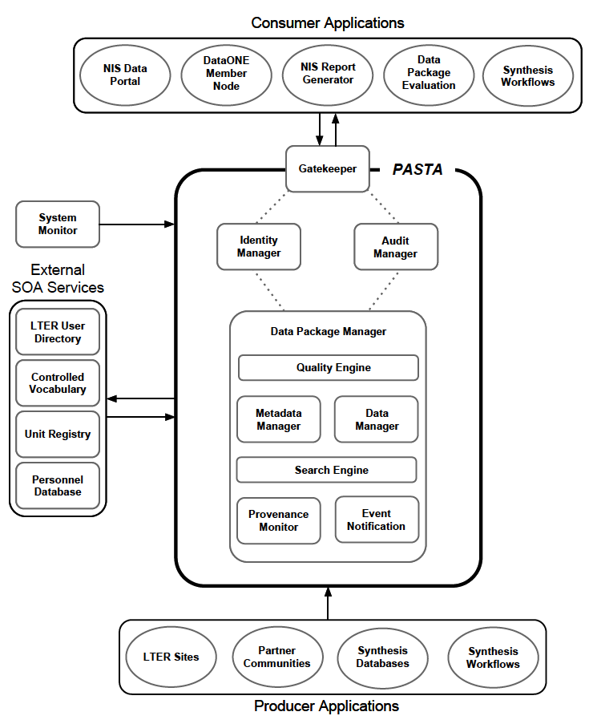

.. About this site page

*******************************
LTER Network Information System
*******************************

The LTER Network Information System (NIS) can be modeled as a production line that facilitates data flow from producers to consumers. As such, organization of the Network Information System can be partitioned into three components: (1) data producers, (2) data warehouses, and (3) data consumers, all working together as part of an ecological research cooperative with the goal of improving the world through science knowledge and education.

Data producers may be represented as either individuals or organizations. In the context of the LTER NIS, data producers are LTER sites, where focus is on collection and generation of data (and metadata) resulting from the enactment of LTER core science, and LTER scientists and students, who collect data resulting from scholarly research at LTER sites or through synthesis -- that is, new data generated by applying analyses against existing data. We envision that site producers “harvest” their data on a regular basis and store them in a data warehouse.

Data warehouses make up the informatics infrastructure used to manage and archive LTER data products, including the “wholesale” and value-added delivery of such products to data consumers. The bulk of LTER data can be contained in one central warehouse, but specialized data products (e.g., GIS or remote sensing imagery) may be stored in separate warehouses for optimal management and performance.

Data consumers are either end users (e.g., scientists) or exist in the form of a “retailer” that better packages data products, along with value-added services, who then caters to end users. Multiple retail services can all access the same data from the warehouses, but each "retailer" provide unique services to different segments of end users. For the NIS, retailers may simply be websites that support applications tailored to serve their communities of scientists.

In the analogy described above, the LTER Network Office is focused on developing a modern and innovative data warehouse infrastructure that will meet the needs of the LTER community. The core of this infrastructure is titled Provenance Aware Synthesis Tracking Architecture or "PASTA".

