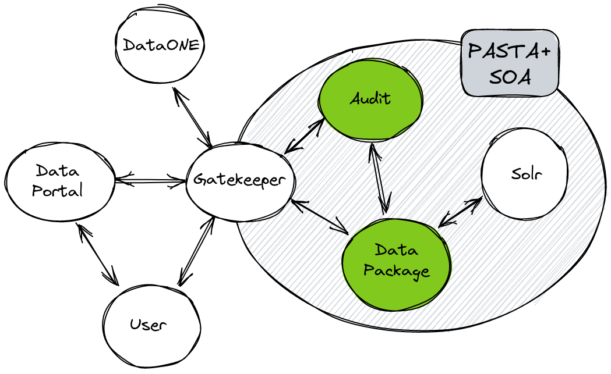

********
REST API
********

The REST API is a set of HTTP endpoints that allow the user to interact with the
**Data Package Manager** and **Audit Manager**. The Data Package Manager service
implements uses cases defined for the management of data packages. The Audit
Manager service implements use cases defined for the management of audit
records.

.. toctree::
   :hidden:
      
   data_package_manager_api
   audit_manager_api
