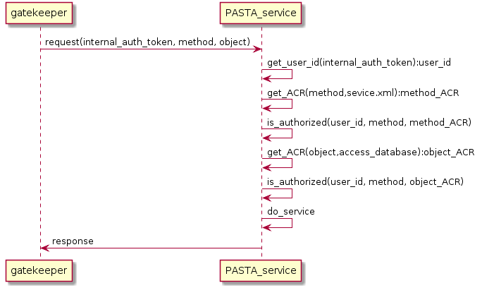

=============
Authorization
=============

Authorization is the process to determine whether a user or group may access (or execute) a protected resource. In the PASTA+ environment, a protected resource consists of either (1) a physical object (e.g., data or metadata files residing on the file-system) or (2) an API method. Authorization is based on the access control rule used to protect the resource and the user requesting access to that resource. In PASTA+, all users and groups are denied access to protected resources unless provided explicit "allow" access through an access control rule.

Access Control Rules
--------------------

The access control rule is a declarative statement that describes the principals and associated permissions for a specific protected resource. The rule itself is declared as being either an **allow** or a **deny** rule, meaning that the following rule definition explicitly permits or blocks a level of access to the resource, respectively.

Principals are simple string values that map to the unique identifier of an :doc:`authenticated user </doc_tree/pasta_arch/gatekeeper>`. For example, a common user identifier used in PASTA+ is in the form of an LDAP distinguished name: ``uid=ucarroll,o=EDI,dc=edirepository,dc=org``. The principal may also be a group identifier, like ``authenticated``, or a role, such as the system user ``pasta`` or the anonymous user ``public``.

Permissions are defined as an hierarchical enumeration of **read**, **write**, or **all** (the permission **changePermisssion** is equivalent to **all**) privileges; for an **allow** rule, **read** permission has the least privilege, while **all** permission has the most privilege (this hierarchy is reversed for **deny** rules). Permission definitions differ between physical objects and API methods as described in the following table:

+--------------------------------+-----------------------------+-------------------------------+
| Permission                     | Physical Object             | API Method                    |
+================================+=============================+===============================+
| **read**                       | Read the object             | Perform a read operation      |
+--------------------------------+-----------------------------+-------------------------------+
| **write**                      | Create or Modify the object | Perform a modifying operation |
+--------------------------------+-----------------------------+-------------------------------+
| **all** (**changePermission**) | Create, Modify, or Modify   | N/A                           |
|                                | Permissions of the object   |                               |
+--------------------------------+-----------------------------+-------------------------------+

Access control rules in the PASTA+ environment are specified using the syntax of the `"access element" <https://knb.ecoinformatics.org/#external//emlparser/docs/eml-2.1.1/./eml-access.html>`_ as declared in the Ecological Metadata Language (EML) version 2.1.1. In fact, access rules for physical objects (i.e., data package metadata and data) must be declared in a valid EML document that describes the uploaded data package found in the EDI data repository. EML is specified as an XML schema, and the corresponding schema definition for the *access element* is graphically depicted below:

    Access rule schema diagram for EML 2.1.1

Access rules may also declare the order of which **allow** or **deny** rules are processed; in other words, should the authorization processor process all **allow** rules first, followed by **deny** rules, or process in the reverse order. Processing **order** is declared in the attributes section of the XML and can be defined as either *allowFirst* or *denyFirst*. A required attribute of the access rule is the **authSystem**, which declares the authorization system for which this rule is appropriate. An example access rule follows:

.. code-block:: xml
    :linenos:

     <access order="allowFirst" authSystem="EDI">
        <allow>
            <principal>uid=ucarroll,o=EDI,dc=edirepository,dc=org</principal>
            <permission>all</permission>
        </allow>
        <allow>
            <principal>public</principal>
            <permission>read</permission>
        </allow>
     </access>

Access Rules in Practice
------------------------

As mentioned above, access rules that are used to protect physical objects must be encoded as part of the EML metadata document used to describe the science data. Ironically, the EML XML schema declares that access rules within the EML document are optional (use of access rules to protect physical resources is strongly encouraged by EDI). It is for this reason why PASTA+ denies access to resources for all users unless an access rule explicitly enables access for a given user (there is an implicit access rule in PASTA+ that allows the user who uploaded the data package full access, equivalent to the **all** permission of an access rule, to the data package and all of its components).

When declared within the EML document, access rules may be placed in two locations: (1) at the very top of the document to cover all components of the data package or (2) at the level of an individual data object (access rules at this level are applied only to the associated data object).

    Access control rule placement within an EML document.

It is common practice to set access rules only at the data package level, which applies to all components of the data package by default. Access rules at the data object level may only be used to reduce access rights that were more open at the data package level. A less common pattern is to allow `public` **read** access to the science metadata, but to restrict data object access to only those users who have authenticated and have been placed in the `authenticated` group. In rare circumstances, the entire data package may be blocked from `public` access to protect sensitive information found in the science metadata. EDI, however, advocates for `public` access to both science metadata and data where possible.

The following are example access control rules that may be found in use within PASTA+.

1. An access control rule for a physical object with a single individual principal with **all** permission; no other access is allowed:

.. code-block:: xml
    :linenos:

     <access order="allowFirst" authSystem="EDI">
        <allow>
            <principal>uid=ucarroll,o=EDI,dc=edirepository,dc=org</principal>
            <permission>all</permission>
        </allow>
     </access>

2. An access control rule for a physical object with multiple individual principals with **all** access and the role `public` with **read** access:

.. code-block:: xml
    :linenos:

     <access order="allowFirst" authSystem="EDI">
        <allow>
            <principal>uid=ucarroll,o=EDI,dc=edirepository,dc=org</principal>
            <principal>uid=bwilliams,o=EDI,dc=edirepository,dc=org</principal>
            <permission>all</permission>
        </allow>
        <allow>
            <principal>public</principal>
            <permission>read</permission>
        </allow>
     </access>

3. An access control rule for a physical object with a single individual principal with **all** access, the group `authenticated` with **read** access, and the role `public` explicitly denied **all** access:

.. code-block:: xml
    :linenos:

     <access order="allowFirst" authSystem="EDI">
        <allow>
            <principal>uid=ucarroll,o=EDI,dc=edirepository,dc=org</principal>
            <permission>all</permission>
        </allow>
        <allow>
            <principal>authenticated</principal>
            <permission>read</permission>
        </allow>
        <deny>
            <principal>public</principal>
            <permission>all</permission>
        </deny>
     </access>

4. An access control rule for a PASTA+ service API method with the `pasta` role and `authenticated` group both having **write** access; the role `public` is forbidden from executing this API method (note the additional XML element that declares this is a service method access control rule, along with the `name` attribute defining the method name):

.. code-block:: xml
    :linenos:

    <pasta:service-method name="createDataPackage">
        <access
            order="allowFirst" authSystem="EDI">
            <allow>
                <principal>pasta</principal>
                <permission>write</permission>
            </allow>
            <allow>
                <principal>authenticated</principal>
                <permission>write</permission>
            </allow>
        </access>
    </pasta:service-method>

Authorization Processing
------------------------

Performing the authorization of a service request in PASTA+ is a simple two-step procedure: (1) determine if the user making the request is authorized to perform the service API method operation, and if allowed, (2) determine if the user making the request is authorized to perform the operation against the physical object that is the subject of the request. This procedure is displayed in the following UML sequence diagram:

   Authorization processing UML sequence diagram.

