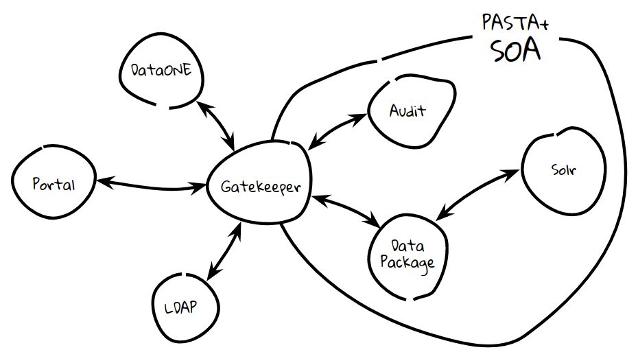

Overview
========

PASTA+ is based on a `Service Oriented Architecture (SOA)
<https://en.wikipedia.org/wiki/Service-oriented_architecture>`_ design pattern:
primary application components operate within the context of their own servers
and communicate between one another using REST web service communications.

There are four primary services within the PASTA+ framework: 1) Audit Manager,
2) Data Package Manager, 3) Gatekeeper, and 4) Solr. The Audit Manager service
provides logging capabilities to all internal services, as well as a user API
for accessing audit logs. The Data Package Manager service provides core
management of all repository data packages (science metadata, data, and
ancillary objects), including upload, arhcive, dowload, and quality
evaluation. The Data Package Manager API is extensive and provides users with
the ability to manage all aspects of their data within the repository. The
Gatekeeper service is a reverse proxy that forwards all requests to one of
PASTA+'s internal services. In addition, the Gatekeeper performs request-based
authentication using either user provided credentials or a short-lived
authentication token. The Solr service is standard deployment of Apache Solr
and indexes all science metadata for search purposes. The Solr service does
not provide a user facing API, but is instead accessed through the Data
Package Manager search API.

