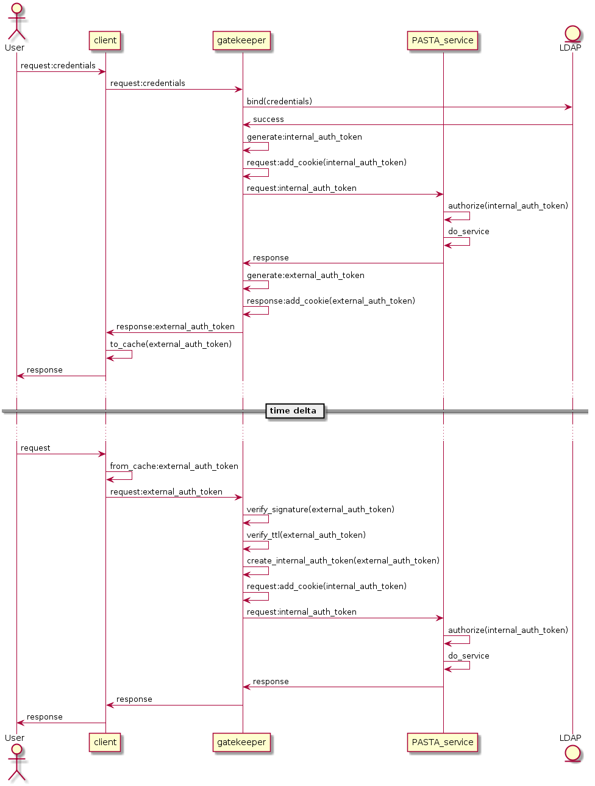

==========
Gatekeeper
==========

The Gatekeeper service is the entry point for all external access to the
underlying PASTA+ infrastructure. The Gatekeeper provides two primary
functions: 1) it serves as a reverse HTTP proxy that inspects all requests,
and then dispatches them to the appropriate PASTA+ end-point service and 2) it
performs authentication processing on all inbound requests. These two
functions are performed in tandem as part of the normal request/authentication
life-cycle of fulfilling a PASTA+ service request as displayed in the
following UML sequence diagram:

   Authentication processing UML sequence diagram.

The *reverse proxy* function of the Gatekeeper is implemented using the Jetty
Java class ``org.eclipse.jetty.proxy.ProxyServlet``, and specifically looks for
patterns that reference the PASTA+ service context in the URL string as
declared in the web.xml configuration file. Values that match the context are
forwarded to the internal end-point service as defined in the web.xml file.

Authentication processing may occur in one of two modes: the client may send
LDAP credentials in the HTTP request; or, the client may send a short-lived
authentication token in the HTTP request that was obtained from an earlier
PASTA+ LDAP credential authentication event.

LDAP credentials are passed to the Gatekeeper using the HTTP request
*Authorization* header as part of the service *request*. Credential passing
utilizes the *basic access authentication* scheme as specified in IETF `RFC
7617 <https://tools.ietf.org/html/rfc7617>`_. Credentials consist of an LDAP
distinguished name and a corresponding password, which are parsed out of the
HTTP *Authorization* header and used to verify the distinguished name through
an LDAP ``bind`` call to a registered LDAP server. A successful ``bind`` will
result in the generation of a short-lived PASTA+ authentication token, which
is used internally for authorization to system or object resources (LDAP
credentials are removed from the HTTP request at the Gatekeeper and are never
forwarded to the PASTA+ end-point service).

A PASTA+ authentication token is a four part string separated by asterisks "*"
and consists of the user's identifier (e.g., LDAP distinguished name), the
authentication system namespace, a time-to-live value (integer), and a comma
delimited list of groups that the user may belong to (note that all
successfully authenticated users belong to the "authenticated" group). Below
is an example authentication token::

    uid=EDI,o=EDI,dc=edirepository,dc=org*https://pasta.edirepository.org/authentication*1531891534443*authenticated

When composed for internal use, the authentication token is *base64* encoded (to
ensure the string is HTTP transport layer friendly), and then added to the
HTTP request as part of the *Cookie* header with the name ``auth-token``.
These **internal authentication tokens** are parsed by the PASTA+ end-point
service for use in authorization processing.

Authentication tokens are returned to the client only in HTTP responses that
originate from an HTTP request containing LDAP credentials. These are
**external authentication tokens** and may be reused by the client in-lieu of
the LDAP credentials for subsequent requests to PASTA+ services. In this case, the
external authentication token is digitally signed by the Gatekeeper, *base64*
encoded, and then added into the HTTP response *Cookie* header using the same
``auth- token`` name as used in the internal authentication token. Although no
part of the authentication token is private, the digital signature prevents
malicious altering of the token, or its individual parts.

When an external authentication token is used in a client HTTP request, the
Gatekeeper parses the authentication token from the *Cookie* header,
validates its digital signature, and then ensures that the time-to-live value
has not expired. If both the digital signature and the time-to-live is valid,
the Gatekeeper removes the digital signature from the authentication token
(i.e., creates an internal authentication token), adds it to the HTTP request
*Cookie* as before, and then forwards the HTTP request to the PASTA+ end-point
service for processing.

.. toctree::
    :hidden:
