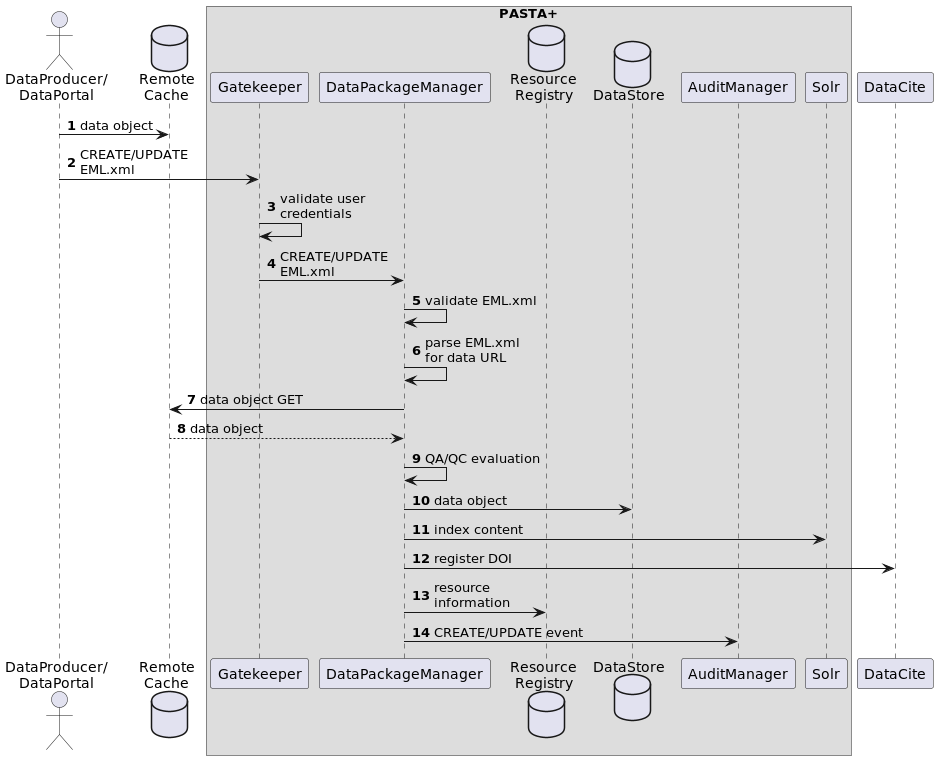

=======================
Data Package Life Cycle
=======================

The following documentation describes the life cycle of a :doc:`data package
</doc_tree/pasta_sop/data_package_definition>` from the time it is submitted to
the EDI data repository to the time it is permanently archived, including the
steps that are taken to ensure that all data are backed up to both near-line and
long-term storage. The EDI data repository follows a *metadata-driven* workflow
that consumes `Ecological Metadata Standard <https://eml.ecoinformatics.org/>`_
(EML) science metadata, along with science data, and produces a data package
that is archived in the repository. That data package is then made available to
the public through the :doc:`PASTA+ REST API
</doc_tree/pasta_api/data_package_manager_api>`.

Life Cycle Events
-----------------

The life cycle of a data package (see UML sequence diagram below) begins when
its producer generates an EML document describing the their science data and
makes that data available on publicly accessible HTTP server for the PASTA+
software to access (**Step 1**). Once the data producer submits the EML document
to the PASTA+ *Gatekeeper* service (**Step 2**), the *Gatekeeper* validates the
user's credentials (**Step 3**) and then forwards the EML document to the *Data
Package Manager* service (**Step 4**). The *Data Package Manager* next validates
the EML for correctness (schema validation, etc.) (**Step 5**) and then
parses the EML to extract the URL of the cached science data (**Step 6**).
The *Data Package Manager* then generates an HTTP GET request (**Step 7**) for
the science data and downloads it from the remote cache (**Step 8**) to a local
cache. The *Data Package Manager* then performs a series of quality checks on
the science metadata and data (**Step 9**). If the quality checks pass, the
*Data Package Manager* then generates the components of the data package and
writes them to a permanent data store (**Step 10**). Next, the *Data Package
Manager* extracts specific search information from the EML and indexes it in the
*Solr* search service (**Step 11**), followed by the creation and registration
of a Digital Object Identifier (DOI) for the data package to the *DateCite* DOI
registry (**Step 12**). Finally, the *Data Package Manager* generates an audit
event and registers it with the *Audit Manager* service (**Step 13**).

    UML sequence diagram of the life cycle of a data package in the EDI data
    repository.

Key Steps
^^^^^^^^^

**Steps 1 & 2:** The "Data Producer/Data Portal" client actor behaves
identically, although REST calls are hidden behind the Data Portal UI/UX. In
each case, science data must be staged in a location that allows for the
PAST+ Data Package Manager service to perform an HTTP GET request to retrieve
the data object. The data object URL is declared in the EML `<distribution>`
element of the `<physical>` subtree.

**Step 3:** To perform a data package upload (`CREATE` or `UPDATE` API
method), the request must be accompanied with user credentials that indicate
the user is a member of the "vetted" group. User credentials are passed as
either an LDAP distinguished and password key/value pair in the HTTP
Authorization header or as a PASTA+ authentication token in the HTTP Cookie
header field (see the discussion on authentication in the PASTA+
:doc:`Gatekeeper </doc_tree/pasta_design/gatekeeper>` service).

**Step 4:** The *Gatekeeper* service acts as both an authentication service
for inbound requests (*Step 3*) and as a reverse proxy to forward validated
requests onto the appropriate service.

**Steps 5 & 6:**

Replication and Backup Strategies
---------------------------------

.. toctree::
    :hidden:
