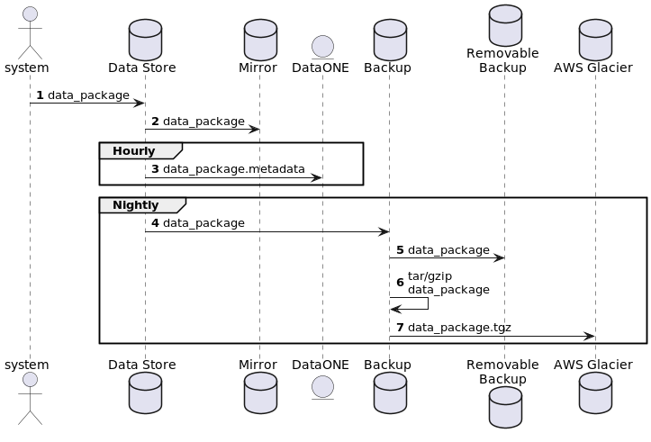

=================================
Replication and Backup Strategies
=================================

Replication and backup strategies ensure all data packages are secure and
recoverable in the event of a catastrophic failure of the primary data store.

Replication and Backup
----------------------

The *replication* and the *backup* of a data package is similar: replication is
a verbatim copy of the entire data store, including directory paths, object
ownership and permissions, and occurs almost immediately when new data package
components are written to the primary data store, where as a backup is a copy of
the data package object bytes and possibly the directory paths, but not
necessarily ownership or permissions. Replication only occurs between the
primary data store and the mirror data store (see UML diagram below). Backup
processing occurs at multiple points and at multiple time-scales within the data
management system.

    UML sequence diagram of data package backup events and frequency in the
    EDI data repository.

Key Steps
^^^^^^^^^

**Step 1:** Archival data package components are written directly to a block
storage filesystem in a directory hierarchy defined by the repository’s internal
identification system. This block storage system consists of a 56TB NetApp
storage array hosted by the Center for Advanced Research Computing at the
University of New Mexico (UNM), Albuquerque, New Mexico USA.

**Step 2:** These components are replicated simultaneously to an
identical NetApp storage array at the university’s Central Information
Technology center, also in Albuquerque, and are available only for fault
recovery purposes.

**Step 3:** The data package metadata objects are synchronized with DataONE (an
ecological metadata aggregator operated by the University of California Santa
Barbara) on an hourly basis.

**Steps 4:** In addition to the primary and secondary block storage systems,
all data and metadata are synchronized nightly to a fixed multi-terabyte backup
system in the EDI office building, also located at UNM.

**Step 5:** Data package components located on the fixed backup system are
written to a removable 8TB backup SSD disk. There are two
SSD disks and these are rotated on a weekly basis, with the offline disk being
stored in an environmentally protected safe in the EDI office building. Only
data packages consider high-value (those that are not available by other means
- for example, Landsat remote sensing data that is also available from the
United States Geological Survey) are copied to removable media.

**Steps 6 & 7:** Finally, a compressed version (Linux ``tar`` and ``gzip``)
of the data package is written to Amazon Web Services S3 Glacier online storage
for off site redundancy.

Consistency between the primary and secondary block storage systems occurs
through internal controller software, while other replicated storage undergoes
automatic fixity checks on a continuous basis. Consistency of data packages on
Glacier occur rarely and are a manual process. The risk management strategy used
to inform this process is primarily “Lots of Copies Keeps Stuff Safe” (LOCKSS),
in addition to ensuring copies are geographically distributed. Longer term
storage is being coordinated with the Dryad Digital Repository.

.. toctree::
    :hidden: