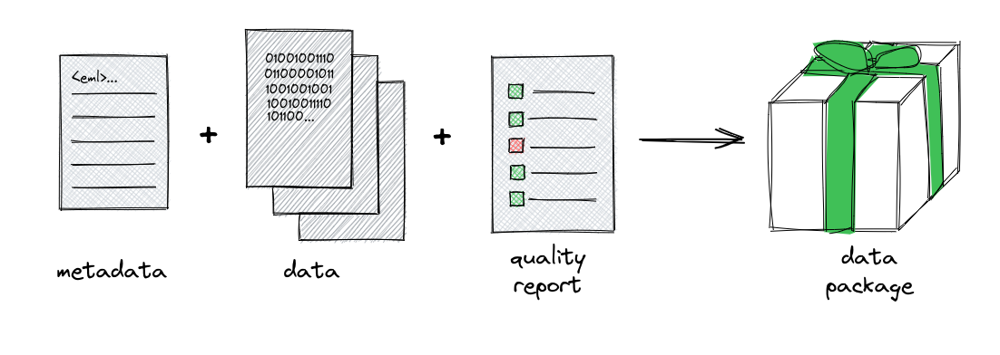

====================
Data Package Defined
====================

The unit of archive (also known as unit of publication) in the EDI data
repository is a **Data Package**. A data package contains science metadata, one
or more science data objects, and a quality report describing how well metadata
and data are aligned.

**Science Metadata**: The science metadata is described using the `Ecological
Metadata Standard <https://eml.ecoinformatics.org/>`_ (EML). The EML must meet
community standards for quality and completeness; otherwise, the data package
will not be accepted into the EDI data repository. Evaluation of the EML is
performed by the EDI data repository quality checking service. EML best
practices for the EID data repository are described `here
<https://ediorg.github.io/data-package-best-practices/>`_.

**Science Data**: The science data are described using the EML and may be in
any digital format, including tabular CSV files, images, or other formats. The
data may be uploaded directly via the EDI Data Portal or may be referenced from
the EML distribution element if they are publicly accessible through an HTTP
request.

**Quality Report**: The quality report is generated by the EDI data repository
quality checking service and describes how well the EML and data are aligned. A
quality report becomes part of the data package as a side-effect of the quality
checking.

Contents of the final data package are more extensive than the components
described above. The original EML science metadata is augmented with
additional information that is specific to the EDI data repository. On disk,
the original metadata is labeled as *Level-0-EML.xml* and the augmented metadata
is labeled as *Level-1-EML.xml*. Original data files are renamed using
the ``md5sum`` hash value of the EML ``<objectName>`` element value. The purpose
of this renaming is to remove any potential OS-level issues with file names that
may contain special characters.

.. toctree::
    :hidden:
