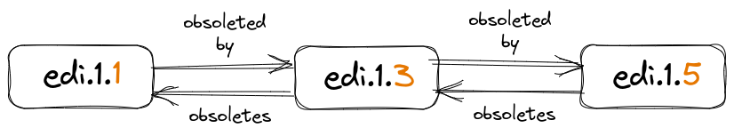

====================
Data Package Defined
====================

The unit of archive (also known as unit of publication) in the EDI data
repository is a **Data Package**. A data package contains science metadata, one
or more science data objects, and a quality report describing how well metadata
and data are aligned.

.. figure:: images/data_package.png
    :align: center
    :scale: 60%

    Components of a PASTA+ data package.

**Science Metadata**: The science metadata is described using the `Ecological
Metadata Standard <https://eml.ecoinformatics.org/>`_ (EML). The EML must meet
community standards for quality and completeness; otherwise, the data package
will not be accepted into the EDI data repository. Evaluation of the EML is
performed by the EDI data repository quality checking service. EML best
practices for the EID data repository are described `here
<https://ediorg.github.io/data-package-best-practices/>`_.

**Science Data**: The science data are described using the EML and may be in
any digital format, including tabular CSV files, images, or other formats. The
data may be uploaded directly via the EDI Data Portal or may be referenced from
the EML distribution element if they are publicly accessible through an HTTP
request.

**Quality Report**: The quality report is generated by the EDI data repository
quality checking service and describes how well the EML and data are aligned. A
quality report becomes part of the data package as a side-effect of the quality
checking.

Contents of the final data package are more extensive than the components
described above. The original EML science metadata is augmented with
additional information that is specific to the EDI data repository. On disk,
the original metadata is labeled as *Level-0-EML.xml* and the augmented metadata
is labeled as *Level-1-EML.xml*. Original data files are renamed using
the ``md5sum`` hash value of the EML `<objectName>` element value. The purpose
of this renaming is to remove any potential OS-level issues with file names that
may contain special characters. The quality report is also an XML file
and named *quality_report.xml*. Finally, metadata information is extracted from
the Level-1 EML and used to generate a Dublin Core metadata document that is
named *Level-1-DC.xml*. This Dublin Core document is available through the
:ref:`Read Metadata Dublin Core <dublin-core>` PASTA+ REST API. For example, a
typical data package resource listing with two data objects on disk might look
like: ::

    482fef41e108b34ad816e96423711470
    cba4645e845957d015008e7bccf4f902
    Level-0-EML.xml
    Level-1-DC.xml
    Level-1-EML.xml
    quality_report.xml

Data Package Identifiers
------------------------

In the context of PASTA+, a package identifier is a unique identifier assigned
to a data package that is stored in the repository. This identifier is internal
to PASTA+ and consists of three parts: the *scope*, *accession*,
and *revision*. The scope is an alpha-numeric string that defines a namespace
under which certain data packages exist (e.g., "edi" or "knb-lter-mcr"). The
accession is a positive integer and uniquely identifies one or more data
packages under the scope namespace. Also a positive integer, the revision
denotes the version of the data package associated with a specific accession of
the scope. New revisions must be a value greater than the previous highest
revision, but not necessarily consecutive. The package identifier is often
represented as the scope, accession, and revision concatenated together with
periods separating the individual parts (below):

.. raw:: html

    
<b>scope.accession.revision</b>

Examples of complete PASTA+ data package identifiers are *edi.1.10* or
*knb-lter-mcr.14.2*.

PASTA+ data package identifiers are also used within system *purls* that
uniquely identify data packages and their components (or *resources* when
considering REST) through the PASTA+ REST API. For example, a full set of
resource *purls* for the *edi.1.1* data package are: ::

    https://pasta.lternet.edu/package/data/eml/edi/1/1/cba4645e845957d015008e7bccf4f902
    https://pasta.lternet.edu/package/data/eml/edi/1/1/482fef41e108b34ad816e96423711470
    https://pasta.lternet.edu/package/metadata/eml/edi/1/1
    https://pasta.lternet.edu/package/report/eml/edi/1/1
    https://pasta.lternet.edu/package/eml/edi/1/1

The public facing identifier is defined by the data package Digital Object
Identifier (DOI). PASTA+ data packages use the EDI DOI shoulder value of
*10.6073*. For example: ::

    doi:10.6073/pasta/a30d5b90676008cfb7987f31b4343a35

The DOI resolves to the PASTA+ data package landing page on the EDI Data
Portal. DOIs do not exist for the individual components of the data package.

Data Package Versioning
-----------------------

Data Packages in PASTA+ are immutable once archived. So how do you update a data
package with new metadata or extend a data table with new time-series data? To
perform an update of an existing data package, you would publish a revision of
the data package, thereby creating a data package series. A data package series
is one or more data package revisions that update either the metadata, the
data, or both the metadata and data of a previous data package in the same
series. PASTA+ uses positive integers to denote the revision chain, with each
more recent revision having a higher value number. These numbers, however, are
not required to be consecutive (below).

    Example revision chain of a PASTA+ data package series. Revision values
    highlighted in orange.

.. toctree::
    :hidden:
