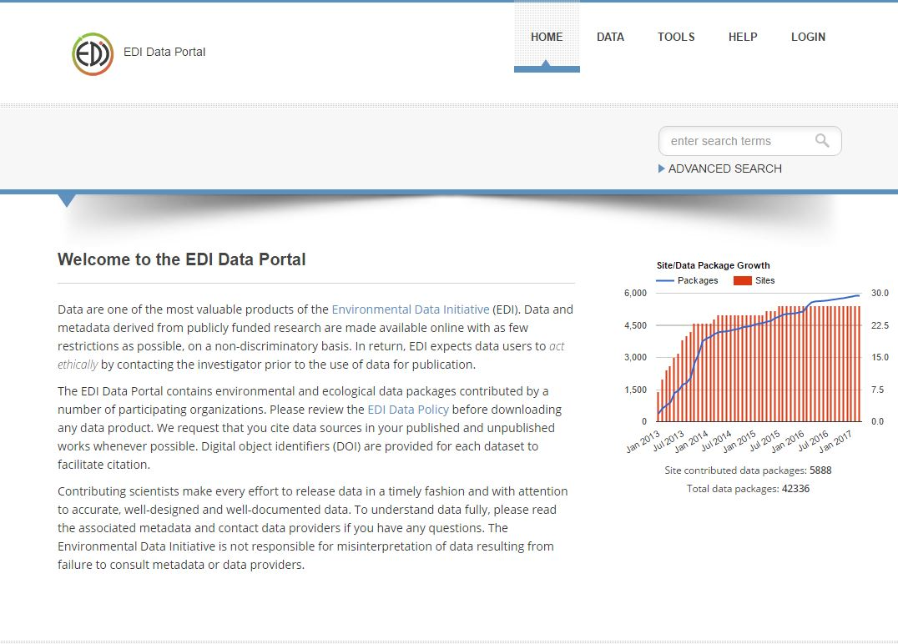

***************************
EDI Data Portal Users Guide
***************************

The EDI Data Portal (https://portal.edirepository.org) is the *de facto* user interface to PASTA for both producers and consumers of EDI data products.

For producers, the Data Portal provides a suite of tools designed to review and upload data packages into PASTA, review actions (e.g., data downloads) against data packages, and subscribe to data "upload" events to trigger off-site workflows.

For consumers, the Data Portal provides a simple search interface that accepts keywords or phrases to find relevant data packages and a set of browsable categories based on a community-curated controlled vocabulary and by data package identifier. There is also an advanced search interface that allows users to refine search criteria into 7 faceted categories, including spatial/place name, research site, subject matter, content creator/organization, temporal, taxonomic, and data package identifier.
